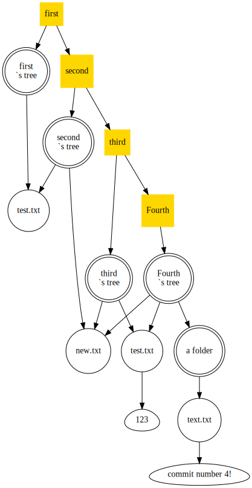

# git folder parser

The program goes through all the folders and, reading the bytes of the files, collects a list of objects. They are sorted into commits, trees, and blobs. Then dependencies are set between them (where necessary) and all this is passed to the class that draws the graph. Moreover, the graph is compiled and drawn automatically, using the additional graphviz library. The folder parsing itself .git and file content analysis takes place without the use of third-party libraries.

In the diagram, commits are marked with yellow squares, trees with double circles, files with regular circles, and the contents of the files are in the "egg shape"(style="egg" is used).
